<div align="center">

# KAgent

**A desktop multi-agent chat framework with toolkits, persistence, memory, and a QML interface**


<br>

<table>
  <tr>
    <td align="center">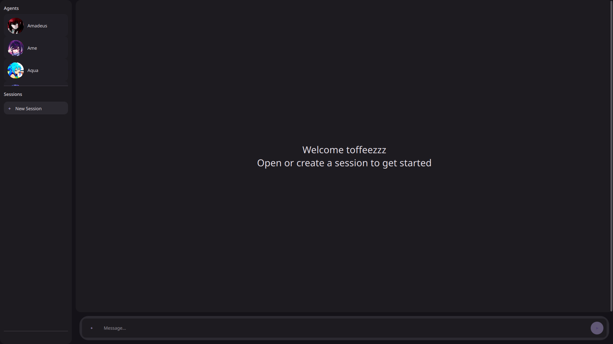</td>
  </tr>
  <tr>
    <td align="center">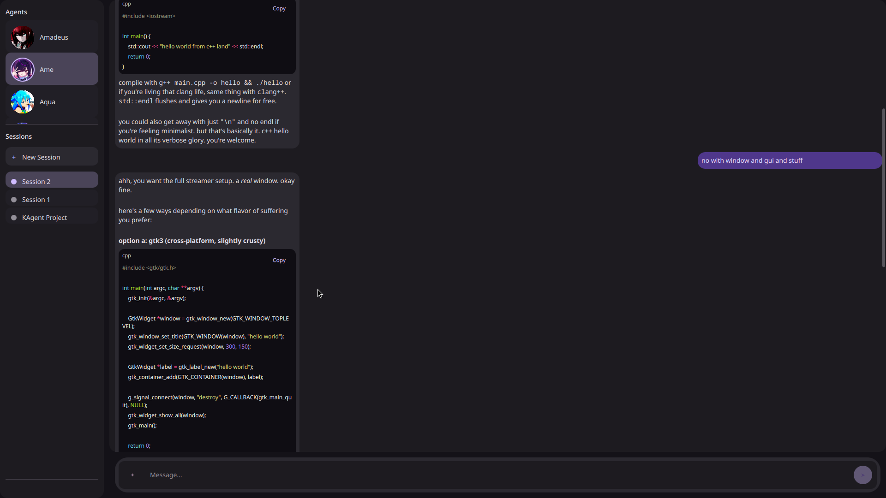</td>
  </tr>
</table>

</div>

---

## Table of Contents

- [What is it?](#what-is-it)
- [Project Objectives](#project-objectives)
- [Features](#features)
  - [Create your own toolkit](#create-your-own-toolkit)
  - [Prebuilt agents](#prebuilt-agents)
  - [Create your own agent](#create-your-own-agent)
- [Technologies Used](#technologies-used)
- [Project Structure](#project-structure)
- [Installation and Setup](#installation-and-setup)
- [How to Use the System](#how-to-use-the-system)
- [OOP Implementation](#oop-implementation)
- [Database](#database)
- [Memory System](#memory-system)
- [Screenshots](#screenshots)
- [Testing](#testing)
- [Known Issues / Limitations](#known-issues--limitations)
- [Author](#author)

---

## What is it?

**KAgent** is a desktop application for building and running AI agents that do real work, not just chat. Each agent has its own personality, voice, and behavior, and can act directly on your local environment through a pluggable toolkit system: reading and writing files, managing a project, and running git operations. You can use the agents that ship with the app or create your own.

Agents are defined by Markdown files with YAML frontmatter that specify the name, model, temperature, reasoning effort, max loop count, and a full persona prompt (including jailbreak resistance and verification keywords). Anyone can add a new agent, or extend what an agent can do with a new toolkit, without touching the core code.

The app uses **OpenRouter** as its LLM provider and supports:

- Function and tool calling through a pluggable toolkit system, so agents can act on your files and repositories
- Image attachments for vision-capable models
- Persistent SQLite storage for sessions, messages, and memory
- A background memory system with embeddings, ranked recall, and decay, so agents learn about you over time
- A Qt Quick (QML) interface with a custom Material You-style theme and hot-reload during development

### The problem it addresses

There is a growing need for an intelligent, interactive assistant that can handle complex tasks such as file system operations, coding, and version control while keeping a coherent conversation context. Existing solutions (Claude Code, ChatGPT, GitHub Copilot) are often tied to specific editors, locked behind a subscription or paywall, limited to a sandbox that can't touch your project files, or lack an extensible tool-calling framework for manipulating the local environment.

KAgent provides a desktop-based, open, and extensible alternative. Instead of one-size-fits-all chatbots, you get multiple agents, each with its own memory, tools, and behavior, living inside your project and operating on it directly. With the toolkit system, people can build **working agents**, not only chatbots to talk to.

### Who is it for?

KAgent is primarily designed for personal use, and it is built for a few kinds of people:

- **People who want more than a stiff assistant.** If you want an agent with a real personality that remembers you and adapts over time, KAgent gives you that out of the box with four prebuilt agents (Amadeus, Ame, Aqua, and Silver Wolf).
- **People who want to create their own agents.** Write a Markdown file with YAML frontmatter and you can define an agent's name, model, temperature, reasoning effort, and a full persona prompt. You decide who the agent is and how it talks, with no changes to the core code. See [Creating Agents](docs/CREATING_AGENTS.md).
- **People who want to customize what their agents can do.** Each agent can be given its own set of tools by building toolkits (a `tools.py` plus a `SKILL.md`). You can write your own toolkits to give an agent exactly the abilities it needs, and agents can discover and enable toolkits themselves. See [Creating Toolkits](docs/CREATING_TOOLKITS.md).
- **Students and developers working on software projects.** KAgent can act as a coding assistant that lives inside your project and can:
  - Read, write, and manage files in the local file system (safety guardrails still need further development)
  - Perform git version control operations (limited to a few operations currently)
  - Be extended with new capabilities through the modular toolkit system

---

## Project Objectives

1. Provide a **multi-agent chat interface** with distinct, persistent personalities.
2. Support **tool use** by agents through a pluggable toolkit and registry system (filesystem operations, git operations).
3. **Persist conversations** in SQLite with full message history per session and per agent.
4. Allow **runtime switching** between agents and sessions.
5. Handle **multi-turn conversations** where agents call tools, receive results, and continue.
6. Support **image attachments** and vision-capable models via base64 encoding.
7. Maintain a **persistent memory system** with embeddings, recall, and decay across sessions.
8. Apply **Object-Oriented Programming** principles (encapsulation, inheritance, polymorphism) in a real, working system.

---

## Features

| Feature | Description |
| --- | --- |
| **Multiple AI agents** | Each agent has its own system prompt, model, temperature, reasoning effort, and max loop count. Agents are defined as Markdown files with YAML frontmatter. Ships with four: Amadeus, Ame, Aqua, and Silver Wolf. |
| **Session-based chat** | Create, rename, and delete sessions. Each session stores its full message history scoped to one agent, and sessions are listed per agent. |
| **Toolkit / function calling** | Agents can call filesystem tools (read, write, list, move, copy, delete, append, get info) and git tools (status, add, commit, diff, restore) through a dynamic toolkit registry. Agents use `register_kit` and `list_kits` to discover and enable toolkits themselves. |
| **Image attachments** | Attach images with the file picker or drag and drop. Images are base64-encoded and sent to vision-capable models, with thumbnails shown inline in the chat. The 4 most recent images in the history window are re-sent, and older ones become text notes. |
| **Persistent memory** | Background memory extraction runs every 6 messages per agent. Memories are embedded with sqlite-vec and stored in `agent.db` alongside the chat history. They are retrieved via cosine similarity with a ranked formula (relevance × 0.6 + importance × 0.25 + recall × 0.15). Memories decay over time and are reinforced on access. |
| **Code syntax highlighting** | Code blocks in chat messages are highlighted with Pygments (Monokai theme) through a custom `CodeHighlighter` that operates on Qt's `QTextDocument`. |
| **Logging** | Rich console output with colored keywords, plus a rotating file handler (10 MB, 5 backups, DEBUG level). |

### Create your own toolkit

Agents can use any toolkit placed in `src/modules/toolkits/kits/`. Each toolkit is a folder with a `tools.py` (the functions) and a `SKILL.md` (instructions for the model). See [Creating Toolkits](docs/CREATING_TOOLKITS.md) for the full guide, and start from the [sample skill](docs/templates/SAMPLE_SKILL.md) and [sample tools](docs/templates/sample_tools.py) templates.

### Prebuilt agents

All four agents currently run on DeepSeek models through OpenRouter. Their settings live in the YAML frontmatter of each file in `src/modules/agents/definitions/` and can be modified.

> [!NOTE]
> Modifications to the agent definitions require a restart to apply.

| Avatar | Agent | Model | Max loops | Temperature | Reasoning effort |
| :-: | --- | --- | :-: | :-: | :-: |
|  | **Amadeus** | `deepseek/deepseek-v4-flash` | 80 | 0.8 | high |
|  | **Ame** | `deepseek/deepseek-v4-flash` | 40 | 0.8 | low |
|  | **Aqua** | `deepseek/deepseek-v4.1-flash` | 50 | 0.8 | low |
|  | **Silver Wolf** | `deepseek/deepseek-v4-flash` | 50 | 0.8 | medium |

### Create your own agent

Want an agent of your own? Add a Markdown file with YAML frontmatter to `src/modules/agents/definitions/` and restart the app. The full walkthrough is in [Creating Agents](docs/CREATING_AGENTS.md), and you can start from the [sample agent template](docs/templates/SAMPLE_AGENT_MD.md).

---

## Technologies Used

| Category | Technology |
| --- | --- |
| **Programming language** | Python 3.11 or newer |
| **GUI framework** | PyQt6 with Qt Quick (QML) using `QQmlApplicationEngine` |
| **LLM API** | OpenAI Python SDK (OpenAI-compatible), pointed at OpenRouter |
| **Database** | SQLite3 via the `sqlite3` standard library module, plus sqlite-vec for vector embeddings |

**Other important libraries and tools**

| Library | Purpose |
| --- | --- |
| `pydantic` | Data models and validation (`AgentDefinition`, `LLMPayload`, `LLMResponse`, `MessageRow`, `SessionRow`, and others) |
| `python-frontmatter` + `PyYAML` | Parsing agent definitions from Markdown files with YAML frontmatter |
| `Pygments` | Syntax highlighting for code blocks in chat (Monokai style) |
| `send2trash` | Safe deletion, moving files to the OS trash instead of deleting permanently |
| `PyMuPDF` + `pymupdf4llm` | Reading PDF and DOCX documents as Markdown through tool calling |
| `qasync` | Qt event loop integration with `asyncio` |
| `python-dotenv` | Loading the API key from a `.env` file |
| `markdown` | Markdown processing |
| `sqlite-vec` | Vector embeddings for memory similarity search |
| `numpy` | Embedding normalization and similarity computations |
| `httpx` | Async HTTP client used by the OpenAI SDK |
| `PyQt6-stubs` | Type stubs for PyQt6, used for static type checking |

**Development dependencies** (install with `pip install -e ".[dev]"`)

| Library | Purpose |
| --- | --- |
| `rich` | Colored console logging |
| `ruff` | Linting and formatting |
| `pytest` | Test framework |
| `pytest-asyncio` | Testing async code |

---

## Project Structure

```text
kagent/
├── pyproject.toml              # Project metadata (v0.2.0), dependencies, dev extras, entry point (kagent command)
├── .env                        # API key (not committed)
├── data/
│   └── agent.db                # Single SQLite database (sessions, messages, attachments, memories, embeddings)
├── docs/
│   ├── imgs/                   # Screenshots
│   ├── templates/              # Sample agent, skill, and tools templates
│   ├── CREATING_AGENTS.md      # Guide: building your own agent
│   └── CREATING_TOOLKITS.md    # Guide: building your own toolkit
├── logs/
│   └── app.log                 # Rotating log file (10 MB, 5 backups, DEBUG level)
├── src/
│   └── modules/
│       ├── backend.py          # Protocol definitions + mock implementations for agents and sessions
│       ├── errors.py           # Base ProgramError exception
│       ├── agents/
│       │   ├── models.py       # BaseAgent (ABC), BasicAgent, CompleteAgent, AgentDefinition
│       │   ├── builder.py      # Agent factory: scans definitions/, builds agents, attaches global prompt + tool registry
│       │   ├── errors.py       # AgentError
│       │   ├── events.py       # AgentEvent dataclasses
│       │   ├── GLOBAL_SYSTEM_PROMPT.md   # Shared prompt injected into every CompleteAgent
│       │   ├── definitions/    # Agent persona files (AMADEUS.md, AME.md, AQUA.md, SILVERWOLF.md)
│       │   └── avatars/        # Agent avatar images
│       ├── database/
│       │   ├── database.py     # SQLite wrapper: schema, sessions, messages, attachments, memories, embeddings, vector search
│       │   ├── models.py       # SessionRow, MessageRow, MemoryRow pydantic models
│       │   └── erros.py        # DatabaseError
│       ├── gui/
│       │   ├── app.py          # Entry point: QApplication, QQmlApplicationEngine, controller wiring
│       │   ├── controller.py   # AppController: bridges QML and Python backends
│       │   ├── models.py       # QAbstractListModel subclasses for QML views
│       │   ├── highlighter.py  # CodeHighlighter (Pygments)
│       │   ├── loader.py       # QmlReloader: hot-reloads the UI on file changes
│       │   └── components/     # QML UI components
│       │       ├── Main.qml    # Root window: toast notifications, loader, hot-reload wiring
│       │       ├── App.qml     # Layout: LeftPanel + RightPanel
│       │       ├── generic/    # Reusable widgets (AppButton, CustomImage, CustomRect)
│       │       ├── left_panel/ # Agent list + session list
│       │       ├── right_panel/# Chat area, message bubbles, input, attachments
│       │       └── theme/      # Theme.qml singleton (colors, spacing, fonts) + qmldir
│       ├── memory/
│       │   ├── models.py       # MemoryRecallRow, MemoryEvent, MemoryExtractionEvent
│       │   ├── service.py      # remember(), recall_block(): embeds text and builds the memories block
│       │   └── extractor.py    # Background memory extraction every 6 messages via BasicAgent
│       ├── server/
│       │   ├── server.py       # Server: wraps AsyncOpenAI (LLM + embeddings, streaming and non-streaming)
│       │   ├── models.py       # LLMPayload, LLMResponse, EmbeddingPayload/Response, LLMParams, etc.
│       │   └── errors.py       # ServerRequestError, LLMRequestError, EmbeddingRequestError
│       ├── toolkits/
│       │   ├── registry.py     # ToolkitRegistry: core + registered + available kits, tool execution, schemas
│       │   ├── builder.py      # build_tool(), build_toolkit()
│       │   ├── scanner.py      # scan_toolkit_dir(): imports tools.py, reads SKILL.md, builds ToolKits
│       │   ├── decorators.py   # @register_tool decorator
│       │   ├── models.py       # Tool, ToolKit, ToolBlueprint, ToolCall, ToolResult, and event dataclasses
│       │   ├── errors.py       # ToolKitError, ToolKitNotFoundError, ToolExecutionError
│       │   └── kits/
│       │       ├── file/       # Filesystem toolkit (SKILL.md + tools.py)
│       │       └── git/        # Git toolkit (SKILL.md + tools.py)
│       └── utils/
│           └── logger.py       # Rich console handler + rotating file handler
└── .gitignore                  # Files to ignore when pushing
```

<details>
<summary><b>Purpose of each major folder and file (click to expand)</b></summary>

<br>

| Path | Purpose |
| --- | --- |
| `pyproject.toml` | Project metadata, dependencies, optional `dev` extras, and the `kagent` command entry point. |
| `.env` | Holds the OpenRouter API key. Not committed to the repository. |
| `data/agent.db` | The application's only SQLite database. Holds sessions, messages, attachments, memories, memory-to-message links, and sqlite-vec embeddings. |
| `agents/models.py` | All agent classes and the `AgentDefinition` metadata model. |
| `agents/builder.py` | Scans `definitions/`, parses the Markdown files, and builds agents with the global prompt and tool registry. |
| `agents/definitions/` | One Markdown file per agent persona, with YAML frontmatter for settings. |
| `agents/events.py` | Event types the agent yields during a run (generating, tool call started/finished, error). |
| `database/database.py` | Creates the whole schema and exposes session, message, attachment, memory, embedding, and vector-search operations. |
| `memory/service.py` | Embeds text through the server and builds the `<memories>` block. Storage, similarity search, ranking, decay, and reinforcement are done by `database.py`. |
| `memory/extractor.py` | Background task that runs a BasicAgent every 6 messages to extract memories from conversation history. |
| `server/server.py` | Sends chat and embedding requests to the LLM provider and parses responses. |
| `toolkits/registry.py` | Tracks toolkits, generates tool schemas, and executes tool calls. |
| `toolkits/kits/` | The actual toolkits: each has a `tools.py` with the functions and a `SKILL.md` with instructions for the model. |
| `gui/app.py` | Application entry point that wires the QML engine to the controller. |
| `gui/controller.py` | Handles user actions from QML, manages async tasks, and tracks per-session status. |
| `gui/models.py` | List models feeding agents, sessions, messages, and attachments into QML. |
| `gui/loader.py` | Watches QML files and reloads the UI during development. |
| `gui/components/` | All QML files making up the interface. |
| `backend.py` | `Protocol` interfaces the controller depends on, plus their implementations. |
| `utils/logger.py` | Logging configuration. |
| `logs/app.log` | Rotating log file written by `utils/logger.py` (10 MB per file, 5 backups, DEBUG level). |
| `docs/imgs/` | Screenshots for documentation. |
| `docs/templates/` | Starter templates for new agents (`SAMPLE_AGENT_MD.md`), toolkit instructions (`SAMPLE_SKILL.md`), and toolkit code (`sample_tools.py`). |
| `docs/CREATING_AGENTS.md` | Step-by-step guide to writing your own agent. |
| `docs/CREATING_TOOLKITS.md` | Step-by-step guide to writing your own toolkit. |

</details>

---

## Installation and Setup

### Prerequisites

- **Python 3.11 or newer**
- **Git**
- An **OpenRouter API key** (create one at [openrouter.ai](https://openrouter.ai))

Check your Python version first:

| Windows | macOS / Linux |
|---|---|
| `python --version` | `python3 --version` |

### Step 1: Clone the repository

Same on all platforms:

```bash
git clone <repo-url>
cd kagent
```

### Step 2: Create and activate a virtual environment

<details open>
<summary><b>Windows</b></summary>

<br>

**PowerShell**

```powershell
python -m venv .venv
.venv\Scripts\Activate.ps1
```

**Command Prompt (cmd)**

```bat
python -m venv .venv
.venv\Scripts\activate.bat
```

> [!TIP]
> If PowerShell blocks the activation script with an execution policy error, run this once and try again:
>
> ```powershell
> Set-ExecutionPolicy -Scope CurrentUser -ExecutionPolicy RemoteSigned
> ```

If `python` is not recognized, use the Python launcher instead: `py -3.11 -m venv .venv`.

</details>

<details open>
<summary><b>macOS / Linux</b></summary>

<br>

```bash
python3 -m venv .venv
source .venv/bin/activate
```

> [!TIP]
> On Debian or Ubuntu, you may need to install the venv module first: `sudo apt install python3-venv`.

</details>

Once activated, your terminal prompt should start with `(.venv)`.

### Step 3: Install the package and dependencies

Same on all platforms, with the virtual environment active:

```bash
pip install -e .
```

This installs KAgent in editable mode along with every dependency listed in `pyproject.toml` and registers the `kagent` command.

For development, install the optional dev extras too (`ruff`, `rich`, `pytest`, `pytest-asyncio`):

```bash
pip install -e ".[dev]"
```

> [!NOTE]
> On some minimal Linux installs, Qt may fail to start with an error about the `xcb` platform plugin. Installing `libxcb-cursor0` (Debian/Ubuntu: `sudo apt install libxcb-cursor0`) usually fixes it.

### Step 4: Set up your environment file

Create a file named `.env` in the project root. The API key is required on every platform. Linux needs one extra line.

<details open>
<summary><b>Windows</b></summary>

<br>

`.env` contents:

```env
API_KEY=sk-or-v1-your_openrouter_key_here
```

**PowerShell**

```powershell
"API_KEY=sk-or-v1-your_openrouter_key_here" | Out-File -Encoding ascii .env
```

**Command Prompt (cmd)**

```bat
echo API_KEY=sk-or-v1-your_openrouter_key_here> .env
```

</details>

<details open>
<summary><b>macOS</b></summary>

<br>

`.env` contents:

```env
API_KEY=sk-or-v1-your_openrouter_key_here
```

```bash
echo "API_KEY=sk-or-v1-your_openrouter_key_here" > .env
```

</details>

<details open>
<summary><b>Linux</b></summary>

<br>

`.env` contents:

```env
API_KEY=sk-or-v1-your_openrouter_key_here
QT_QPA_PLATFORMTHEME=xdgdesktopportal
```

```bash
printf "API_KEY=sk-or-v1-your_openrouter_key_here\nQT_QPA_PLATFORMTHEME=xdgdesktopportal\n" > .env
```

> [!IMPORTANT]
> `QT_QPA_PLATFORMTHEME=xdgdesktopportal` is required on Linux. Without it, the QML interface can fail to render correctly.

</details>

> [!NOTE]
> The app uses OpenRouter as its LLM provider. The base URL is hardcoded to `https://openrouter.ai/api/v1` in `gui/app.py`.

> [!WARNING]
> Never commit your `.env` file. Make sure it is listed in `.gitignore`.

> [!NOTE]
> There is no separate config file. Each agent's model, temperature, reasoning effort, and max loop count are set in the frontmatter of its file in `src/modules/agents/definitions/`.

### Step 5: Run the application

<details open>
<summary><b>Windows</b></summary>

<br>

```powershell
kagent
```

Or run the module directly:

```powershell
python -m modules.gui.app
```

</details>

<details open>
<summary><b>macOS / Linux</b></summary>

<br>

```bash
kagent
```

Or run the module directly:

```bash
python3 -m modules.gui.app
```

</details>

> [!TIP]
> Both commands must be run with the virtual environment activated. If you open a new terminal later, activate the environment again (Step 2) before launching.

---

## How to Use the System

1. **Launch the app.** You'll see a dark-themed two-panel window. The left panel shows agents (with avatars) and their sessions, and the right panel is the chat area.
2. **Select an agent** from the left panel. Available agents: **Amadeus, Ame, Aqua, Silver Wolf**. Each has a unique personality defined in its Markdown file. You can also [create your own agent](#create-your-own-agent).
3. **Create a new session** with the **New Session** button. Sessions are scoped per agent. Click an existing session to load its history.
4. **Type your message** in the input field at the bottom right. Press **Enter** to send, or **Shift+Enter** for a newline.
5. **Attach images** (optional) with the attachment button or by dragging files into the input area. Images appear as thumbnails.
6. **Watch the agent respond.** Status text shows what is happening: "Thinking..." during LLM calls and "Running tool_name..." during tool execution.
7. **Stop generation** at any time with the stop button, which appears while the agent is generating.
8. **Right-click a session** in the left panel to rename or delete it.
9. **Switch agents or sessions freely.** Each agent has its own isolated conversation history and memory.

---

## OOP Implementation

### Key classes

| Class | File | Role |
| --- | --- | --- |
| `ProgramError` | `errors.py` | Base exception for all project errors. Has a `message` field. |
| `BaseAgent` *(ABC)* | `agents/models.py` | Abstract base for all agents. Owns name, model, system prompt, and LLM params. Defines `generate()` and abstract `_build_payload()`. |
| `BasicAgent` | `agents/models.py` | Stateless one-shot agent (system + user message, no history, no tools). Skips the speaker tag and ignores the username. Used for memory extraction and one-off tasks. |
| `CompleteAgent` | `agents/models.py` | Stateful agent with message history, tool calling, memory recall (`_memory_message()`), and a multi-loop run cycle (`_run_loop` up to `_max_loops`). The main chat agent. Has `run()` (yields events) and `generate()` (drains the loop). |
| `AgentDefinition` | `agents/models.py` | Pydantic model parsed from frontmatter: `name`, `image_path`, `type` (basic/complete), `language_model`, `max_loop`, `params`. |
| `AgentError` | `agents/errors.py` | Subclass of `ProgramError` that adds a `name` field. |
| `Database` | `database/database.py` | SQLite singleton (`@final` class with a module-level `DATABASE` instance). Creates the full schema and owns all CRUD for sessions, messages, attachments, memories, memory links, and embeddings, plus KNN search and ranked recall. Foreign keys use `ON DELETE CASCADE`. |
| `SessionRow` / `MessageRow` / `MemoryRow` | `database/models.py` | Pydantic models for database rows. `MessageRow` has `attachments: tuple[str, ...]`. `MemoryRow` carries `message_ids` and, for search results, `similarity` and `score`. |
| Memory service | `memory/service.py` | Embeds text through `Server` and builds the `<memories>` block. Functions: `remember()` and `recall_block()`. Storage, vector search, decay, and reinforcement are delegated to `Database`. |
| `MemoryExtractor` | `memory/extractor.py` | Runs every 6 messages per agent. Uses a `BasicAgent` to summarize new conversation turns into structured memories, then stores them through the memory service. |
| `Server` | `server/server.py` | Wraps the `AsyncOpenAI` client. Methods: `send_request_llm()`, `send_request_embedding()`, and the unused `_request_llm_streaming()`. |
| `ToolkitRegistry` | `toolkits/registry.py` | Manages three kit dicts: `_core_kits` (always active, including the registry kit with `register_kit` / `list_kits`), `_registered_kits`, and `_available_kits`. Generates OpenAI tool schemas and concatenated skill instructions. `execute_tool()` dispatches calls. |
| `ToolKit` / `Tool` / `ToolBlueprint` / `ToolResult` | `toolkits/models.py` | Dataclasses. `ToolResult[T]` is generic with `ok`, `message`, `data`, `expose_data`, and `to_content()` (serializes to a JSON string for the LLM). |
| `ToolExecutionError` / `ToolKitError` / `ToolKitNotFoundError` | `toolkits/errors.py` | Exception hierarchy for toolkit errors, with `kit_name` and `tool_name` fields. |
| `AppController` | `gui/controller.py` | `QObject` bridging QML and Python. Holds backends via protocols. Emits `selectedAgentChanged`, `selectedSessionChanged`, `generatingChanged`, `errorOccurred`, and `restoreInput`. Manages async send tasks per session. |
| `AgentListModel` | `gui/models.py` | `QAbstractListModel` exposing agent names and image paths to QML through custom roles. |
| `SessionListModel` | `gui/models.py` | Session list with `reset_to()`, `prepend()`, `rename()`, and `remove_by_id()`. |
| `MessageListModel` | `gui/models.py` | Message list with pending message support (temporary IDs, `confirm_pending()`, `remove_by_id()`). |
| `AttachmentListModel` | `gui/models.py` | Manages attachments before sending. `take()` clears and returns them, and `restore()` puts them back on failure. |
| `CodeHighlighter` | `gui/highlighter.py` | `QObject` with `@pyqtSlot` methods. Applies Pygments styles to a `QTextDocument` via `QTextCursor.mergeCharFormat`. |
| `QmlReloader` | `gui/loader.py` | Watches the QML directory with `QFileSystemWatcher`, debounces changes with a 150 ms `QTimer`, calls `engine.clearComponentCache()`, then emits `reload`. |
| `MockAgentsBackend` / `MockSessionBackend` | `backend.py` | Protocol implementations. `MockAgentsBackend` uses `scan_agent_dir()` and delegates to `CompleteAgent.run()`. `MockSessionBackend` wraps `Database`. |

### Architecture overview

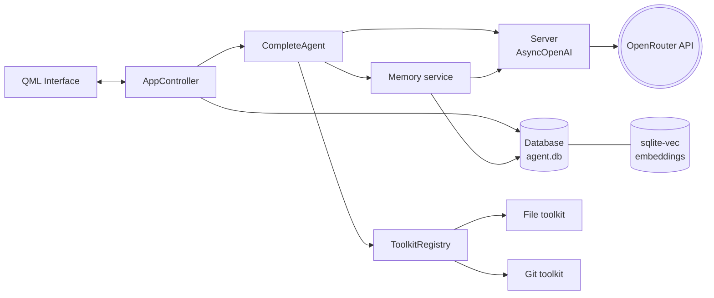

### Encapsulation

- **`CompleteAgent._messages`** is private. History is only modified inside `_run_loop()` and `_record_failure()`. External code can only call `reset()`, `run()`, or `generate()`.
- **`ToolkitRegistry`** hides its three kit dicts and the `_tool_to_kit` lookup. External code uses only `register_kit()`, `list_kits()`, `execute_tool()`, and the read-only `schemas`, `skills`, and `available_kits` properties.
- **`Database`** is a `@final` class. All internal SQL, embedding serialization, and the ranking math (`_memory_score`, `_effective_recall`, `_similarity`) are hidden behind session, message, and memory methods.
- **Memory service** keeps embedding computation and the `<memories>` block formatting in one place. External code calls `remember()` and `recall_block()`.
- **`AppController`** encapsulates async task management (`_tasks` dict), per-session status tracking (`_status` dict), and all signal emissions.

### Inheritance

- **Exception hierarchy:**
  - `ProgramError` → `AgentError` (adds `name`)
  - `ProgramError` → `DatabaseError`
  - `ProgramError` → `ToolKitError` (adds `kit_name`) → `ToolExecutionError` (adds `tool_name`), `ToolKitNotFoundError`
  - `AgentError` → `ServerRequestError` → `LLMRequestError` / `EmbeddingRequestError`
- **Agents:**
  - `BaseAgent` (ABC) → `BasicAgent` (overrides `_build_user_message()` and `_build_payload()`)
  - `BaseAgent` → `CompleteAgent` (overrides `_build_payload()` with tool schemas and memory block, and adds `run()`, `_run_loop()`, `_run_tools()`, `_memory_message()`, `generate()` with a `tool_choice` parameter, `reset()`, and `_record_failure()`)
- **`AgentDefinition`** uses Pydantic validation with `@model_validator` to enforce constraints (basic agents cannot have `max_loop` or `image_path`).
- **Qt models:** `AgentListModel`, `SessionListModel`, `MessageListModel`, and `AttachmentListModel` all extend `QAbstractListModel` and override `rowCount()`, `data()`, and `roleNames()`. `AppController` extends `QObject`.

### Polymorphism

- **Protocol-based backends:** `SessionsBackend` and `AgentsBackend` are `Protocol` classes in `backend.py`. `MockSessionBackend` and `MockAgentsBackend` implement them, and `AppController` depends only on the protocols, never on concrete classes.
- **`BaseAgent.generate()`** is overridden in `CompleteAgent` with an extended signature (adds `tool_choice`). Both subclasses satisfy the base contract.
- **`AgentEvent` union type:** `GeneratingResponse | GenerationFinished | ToolCallStarted | ToolCallFinished | RunError`. `AppController._send()` dispatches on each variant using `match event:`.
- **Tool execution:** `ToolkitRegistry.execute_tool()` handles async and sync tool functions transparently. Async functions are awaited, and sync functions run through `loop.run_in_executor()`.
- **`_build_user_message()`** is overridden: `BaseAgent` tags messages with `[User name]`, while `BasicAgent` strips the tag and uses plain text.
- **Error handling:** in `CompleteAgent._run_tools()`, tool failures never raise. They return `ToolResult(ok=False)`, which the model can see and retry.

---

## Database

**File:** `data/agent.db` (SQLite3 with the sqlite-vec extension)

`database.py` creates the entire schema on startup and holds every table: chat data (sessions, messages, attachments) and memory data (memories, memory links, embeddings). There is no second database file.

### Entity relationship

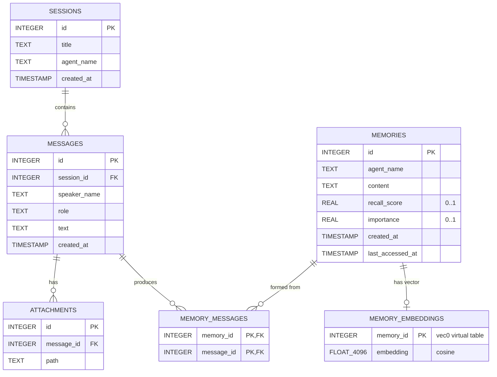

### Tables

<details open>
<summary><b>sessions</b></summary>

| Column | Type | Constraints | Description |
| --- | --- | --- | --- |
| `id` | INTEGER | PRIMARY KEY AUTOINCREMENT | Unique session ID |
| `title` | TEXT | NOT NULL | Session display name |
| `agent_name` | TEXT | NOT NULL | Which agent this session belongs to |
| `created_at` | TIMESTAMP | DEFAULT CURRENT_TIMESTAMP | Creation timestamp (UTC) |

</details>

<details open>
<summary><b>messages</b></summary>

| Column | Type | Constraints | Description |
| --- | --- | --- | --- |
| `id` | INTEGER | PRIMARY KEY AUTOINCREMENT | Unique message ID |
| `session_id` | INTEGER | NOT NULL, FK to `sessions(id)` ON DELETE CASCADE | Parent session |
| `speaker_name` | TEXT | NOT NULL | Who said it (username or agent name) |
| `role` | TEXT | NOT NULL | `"user"` or `"assistant"` |
| `text` | TEXT | NOT NULL | Message content |
| `created_at` | TIMESTAMP | DEFAULT CURRENT_TIMESTAMP | Message timestamp (UTC) |

</details>

<details open>
<summary><b>attachments</b></summary>

| Column | Type | Constraints | Description |
| --- | --- | --- | --- |
| `id` | INTEGER | PRIMARY KEY AUTOINCREMENT | Unique attachment ID |
| `message_id` | INTEGER | NOT NULL, FK to `messages(id)` ON DELETE CASCADE | Parent message |
| `path` | TEXT | NOT NULL | Filesystem path to the attachment |

</details>

The memory tables (`memories`, `memory_messages`, `memory_embeddings`) are documented in the [Memory System](#memory-system) section.

**Indexes:** `idx_messages_session` on `messages(session_id, id)`, `idx_attachments_message` on `attachments(message_id)`, `idx_memories_agent` on `memories(agent_name, id)`, and `idx_memory_messages_message` on `memory_messages(message_id)`.

### Major database operations

| Operation | Function | SQL |
| --- | --- | --- |
| **Create** session | `create_session(title, agent_name)` | `INSERT INTO sessions` |
| **Read** session | `get_session(id)` | `SELECT * FROM sessions WHERE id = ?` |
| **Read** session list | `get_session_list(agent_name)` | `SELECT * FROM sessions WHERE agent_name = ? ORDER BY created_at DESC, id DESC` |
| **Update** session | `rename_session(title, id)` | `UPDATE sessions SET title = ? WHERE id = ?` |
| **Delete** session | `delete_session(id)` | `DELETE FROM sessions WHERE id = ?` (cascades to messages, attachments, and memory links; the memories themselves stay) |
| **Create** message | `add_message(session_id, role, text, speaker_name, attachments)` | `INSERT INTO messages` + `INSERT INTO attachments` (`executemany`), wrapped in a transaction |
| **Read** messages | `get_messages(session_id)` | `SELECT * FROM messages WHERE session_id = ? ORDER BY id`, plus a `SELECT` on attachments joined to messages, grouped by `message_id` |
| **Read** single message | `get_message(message_id)` | `SELECT * FROM messages WHERE id = ?` + `SELECT path FROM attachments WHERE message_id = ?` |
| **Create** memory | `add_memory(agent_name, content, embedding, importance, recall_score, message_ids)` | `INSERT INTO memories` + `INSERT OR IGNORE INTO memory_messages` + `INSERT INTO memory_embeddings`, in one transaction |
| **Read** memories | `get_memory(id)` / `get_memory_list(agent_name, limit)` | `SELECT * FROM memories ...`, plus one query for linked message IDs |
| **Update** memory scores | `update_memory_scores(id, recall_score, importance)` | `UPDATE memories SET ...` (does not touch `last_accessed_at`) |
| **Reinforce** memory | `reinforce_memory(id, boost, importance)` | `UPDATE memories SET recall_score, importance, last_accessed_at = CURRENT_TIMESTAMP` |
| **Delete** memory | `delete_memory(id)` | `DELETE FROM memories WHERE id = ?` (a trigger removes the embedding, cascade removes the links) |
| **Link** memory and message | `link_memory_message()` / `get_memory_messages()` / `get_message_memories()` | `INSERT OR IGNORE INTO memory_messages`, and joins in both directions |
| **Embeddings** | `set_embedding(id, embedding)` / `get_embedding(id)` | `DELETE` + `INSERT` on `memory_embeddings`, and `SELECT embedding` |
| **Similarity search** | `search_memories(agent_name, query_embedding, limit)` | KNN query on `memory_embeddings` (`embedding MATCH ? AND k = ?`) joined to `memories` |
| **Ranked recall** | `recall_memories(agent_name, query_embedding, limit, ...)` | KNN query, then ranking in Python, then `UPDATE memories` to reinforce the returned rows |
| **Search** (text) | *(filter only)* | No free-text search. Sessions are filtered by `agent_name` and messages by `session_id`. |

UTC timestamps from SQLite are converted to local-timezone 12-hour format (`"%b %d, %I:%M %p"`) by `_utc_to_local_12h()`, for both messages and memories.

---

## Memory System

**Storage:** the same `data/agent.db`, using the sqlite-vec extension for vectors.

Memory lives in its own tables but shares the database with the chat history. Each agent has its own memories, which are recalled during conversations and updated in the background.

### How it works

1. **Extraction:** Every 6 messages in a conversation, `MemoryExtractor` runs a `BasicAgent` (named `MEMORY_EXTRACTOR`) that summarizes the new turns into structured memories (content and importance score).
2. **Storage:** Each memory is embedded through the OpenRouter-compatible API (a Qwen3 embedding model, 4096 dimensions) and saved by `Database.add_memory()`. The memory row, its links to the source messages, and its vector are written in one transaction.
3. **Recall:** Before each agent response, `CompleteAgent._memory_message()` calls `recall_block()` with the newest user message. Up to 3 memories are placed in a system message right before that user message, as a `<memories>` block. The block is used for that turn only and is removed from the history afterwards.
4. **Ranking:** The database finds the 20 nearest candidates, drops any below the minimum similarity (0.35), and scores the rest with `relevance × 0.6 + importance × 0.25 + effective recall × 0.15`. Relevance is cosine similarity, importance comes from the extraction prompt, and effective recall is the stored recall score after time decay.
5. **Decay:** Recall decays exponentially with a 14-day half-life, measured from `last_accessed_at`.
6. **Reinforcement:** Each memory that is recalled gets +0.2 added to its decayed recall score (capped at 1.0), and its decay clock is reset.
7. **Deduplication:** If a new memory has cosine similarity ≥ 0.92 with an existing one, it is treated as a duplicate and the existing memory is reinforced instead of inserting a new one.

### Ranking constants

| Constant | Value | Meaning |
| --- | --- | --- |
| `W_RELEVANCE` / `W_IMPORTANCE` / `W_RECALL` | 0.60 / 0.25 / 0.15 | Weights of the ranking formula |
| `MIN_SIMILARITY` | 0.35 | Below this a memory is treated as unrelated |
| `RECALL_HALF_LIFE_DAYS` | 14 | Idle days after which the recall score halves |
| `RECALL_BOOST` | 0.2 | Added to the decayed recall score on each recall |
| `DUPLICATE_SIMILARITY` | 0.92 | Similarity at or above which a new memory counts as a duplicate |
| `EMBEDDING_DIM` | 4096 | Vector size of the `memory_embeddings` table |

### Tables

<details open>
<summary><b>memories</b></summary>

| Column | Type | Constraints | Description |
| --- | --- | --- | --- |
| `id` | INTEGER | PRIMARY KEY AUTOINCREMENT | Unique memory ID |
| `agent_name` | TEXT | NOT NULL | Which agent the memory belongs to |
| `content` | TEXT | NOT NULL | The memory text |
| `recall_score` | REAL | NOT NULL, DEFAULT 1.0, CHECK 0 to 1 | Base recall strength, before time decay |
| `importance` | REAL | NOT NULL, DEFAULT 0.5, CHECK 0 to 1 | Importance score |
| `created_at` | TIMESTAMP | DEFAULT CURRENT_TIMESTAMP | Creation timestamp (UTC) |
| `last_accessed_at` | TIMESTAMP | DEFAULT CURRENT_TIMESTAMP | Last time the memory was created or recalled (the decay clock) |

</details>

<details open>
<summary><b>memory_messages</b></summary>

Many-to-many link between memories and the messages they were formed from. One memory can come from several messages, and one message can produce several memories.

| Column | Type | Constraints | Description |
| --- | --- | --- | --- |
| `memory_id` | INTEGER | NOT NULL, FK to `memories(id)` ON DELETE CASCADE | The memory |
| `message_id` | INTEGER | NOT NULL, FK to `messages(id)` ON DELETE CASCADE | A source message |

The primary key is the pair (`memory_id`, `message_id`). Deleting a session removes its links, but the memories remain.

</details>

<details open>
<summary><b>memory_embeddings</b></summary>

| Column | Type | Constraints | Description |
| --- | --- | --- | --- |
| `memory_id` | INTEGER | PRIMARY KEY | Mirrors `memories.id` |
| `embedding` | float[4096] | `distance_metric=cosine` | The memory's vector |

This is a sqlite-vec `vec0` virtual table. Virtual tables cannot have foreign keys, so the trigger `trg_memories_delete_embedding` deletes a memory's embedding whenever the memory is deleted.

</details>

---

## Screenshots

<table>
  <tr>
    <td align="center" width="50%">
      <br>
      <b>Welcome Screen</b><br>
      <sub>Initial state before any session is selected, showing the agent list in the left panel and a placeholder in the right panel.</sub>
    </td>
    <td align="center" width="50%">
      <br>
      <b>Sample Chat 1</b><br>
      <sub>An example conversation showing user messages and agent responses.</sub>
    </td>
  </tr>
  <tr>
    <td align="center" width="50%">
      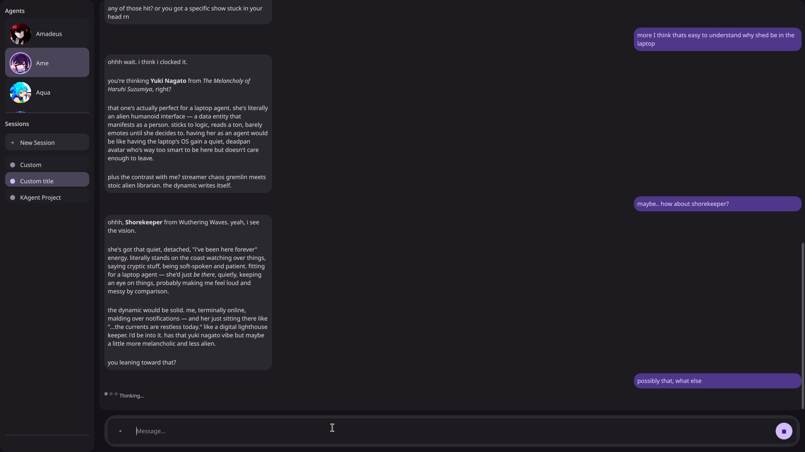<br>
      <b>Sample Chat 2</b><br>
      <sub>Another conversation example, including code blocks with syntax highlighting.</sub>
    </td>
    <td align="center" width="50%">
      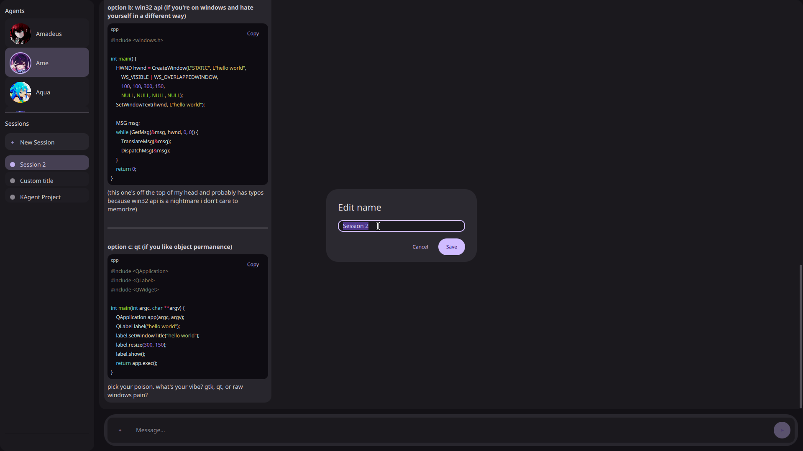<br>
      <b>Session Renaming</b><br>
      <sub>The rename dialog, opened from the right-click menu on a session.</sub>
    </td>
  </tr>
  <tr>
    <td align="center" width="50%">
      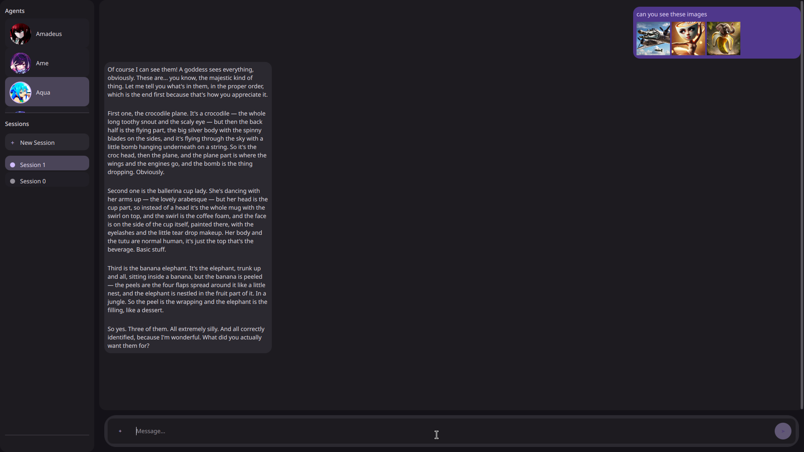<br>
      <b>Vision Model</b><br>
      <sub>Chat with an image attachment processed by a vision-capable model, with the image thumbnail shown in the message bubble.</sub>
    </td>
    <td align="center" width="50%">
      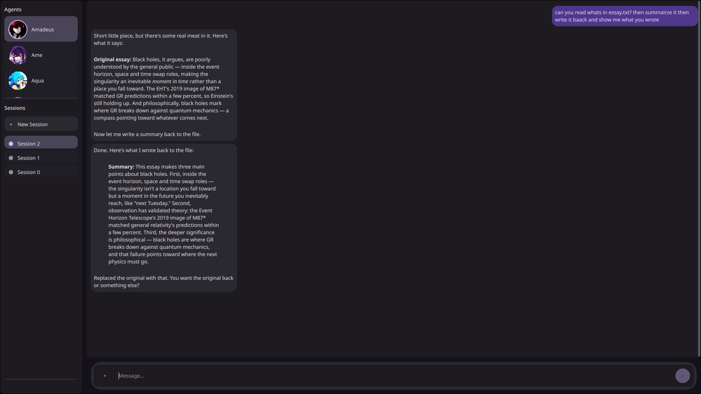<br>
      <b>Read / Write Test</b><br>
      <sub>An agent using the file toolkit to read and write files during a tool-calling test.</sub>
    </td>
  </tr>
  <tr>
    <td align="center" width="50%">
      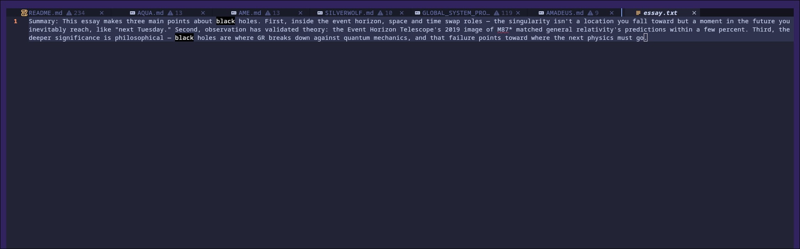<br>
      <b>Write Output</b><br>
      <sub>The result of the write operation, confirming the file was created.</sub>
    </td>
    <td align="center" width="50%">
      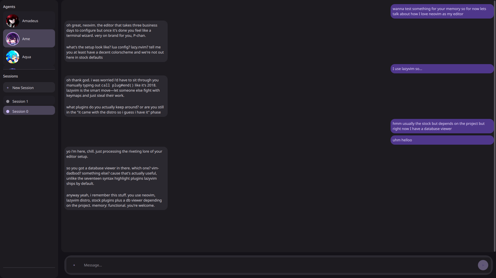<br>
      <b>Memory Saving</b><br>
      <sub>The memory extractor running in the background, saving a new memory after 6 messages of conversation.</sub>
    </td>
  </tr>
  <tr>
    <td align="center" colspan="2">
      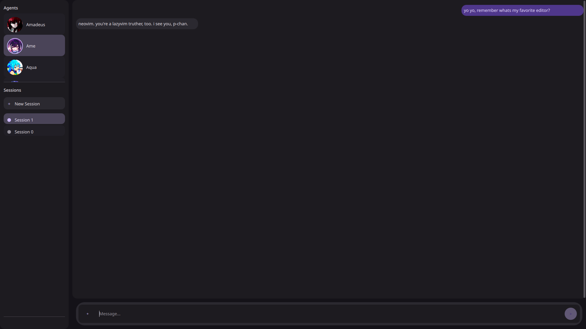<br>
      <b>Memory Retrieving</b><br>
      <sub>The agent retrieving relevant memories from the database and injecting them into the conversation context.</sub>
    </td>
  </tr>
</table>

---

## Testing

> [!NOTE]
> Testing was done **manually** by running the application. `pytest` and `pytest-asyncio` are included as dev dependencies, ready for when tests are added.

### Manual test cases

| # | Feature | Test procedure | Expected result | Actual result |
| --- | --- | --- | --- | --- |
| 1 | **Agent loading** | Launch the app and look at the left panel. | All 4 agents appear with the correct avatars. | Pass. All 4 agents appear. |
| 2 | **Create session** | Click **New Session**. | A new session appears and becomes active. | Pass. |
| 3 | **Rename session** | Right-click a session and choose rename. | The title updates in the list and in the database. | Pass. |
| 4 | **Delete session** | Right-click a session and choose delete. | The session and its messages and attachments are removed. | Pass. Removed through cascade delete. |
| 5 | **Send message** | Type a message and press Enter. | The message appears in the chat, then the agent replies. | Pass. |
| 6 | **Tool calling** | Send *"list files in the current directory"* or *"create a file called test.txt"*. | A "Running tool_name..." status appears, the tool runs, and the agent reports the result. | Pass. |
| 7 | **Image attachment** | Attach an image and send. | A thumbnail appears in the message bubble and the image is included in the API request. | Pass. |
| 8 | **Stop generation** | Click the stop button while the agent is responding. | Generation stops and the UI returns to idle. | Pass. |
| 9 | **File toolkit read/write** | Ask an agent to read a sample file and write a new file. | The agent reads the file and writes the output with the expected content. | Pass. See `read_write_test.jpg` and `write_output.jpg`. |

### Code-level verification points

- The agent scanner (`agents/builder.py`) handles a missing definitions directory, a missing global prompt, non-Markdown files, invalid YAML, invalid frontmatter params, and unexpected exceptions, each with a warning or error and a graceful skip.
- Database schema creation uses `CREATE TABLE IF NOT EXISTS`, `CREATE INDEX IF NOT EXISTS`, and `CREATE TRIGGER IF NOT EXISTS`, so it is safe to re-run.
- `Database.add_message()` wraps the message insert and attachment inserts in a `with self.conn:` transaction, and `add_memory()` does the same for the memory row, its links, and its embedding.
- Scores are validated: `importance` and `recall_score` must be between 0 and 1 (checked in Python and by `CHECK` constraints), and embeddings must have exactly 4096 dimensions.
- `CompleteAgent._run_loop()` catches `BaseException` (including `asyncio.CancelledError`) so the history is always left consistent.
- File tools validate paths against a sandbox root directory, so blocked paths are unreachable even with `..` or symlinks.
- `delete_file_or_dir` requires a two-step confirmation: without `confirm` it only reports, and with `confirm=True` it moves the target to the trash.
- Memory extraction deduplicates at ≥ 0.92 cosine similarity, preventing memory bloat from near-identical entries.
- `Database.recall_memories()` drops candidates below a minimum similarity of 0.35 and returns at most the requested number of ranked memories (3 in normal use).

---

## Known Issues / Limitations

> [!NOTE]
> KAgent is **in development** (v0.2.0). **Issues** are things that behave wrongly or fragilely today. **Limitations** are features that are missing or design choices that restrict what it can do.

### Known Issues

- **Duplicate agent names collide.** Agents are stored by `name`, so if two definition files share one, the later overwrites the earlier. Both still appear in the UI list.
- **Same agent, two sessions at once.** Each `CompleteAgent` keeps a single `_messages` list that is replaced at the start of every run, so running two sessions of the same agent simultaneously can mix their histories.
- **Broken agent definitions fail silently.** Invalid YAML or frontmatter is only logged, so a broken agent just doesn't appear. `AgentDefinition` forbids extra keys, so one typo rejects the whole agent, and the warning always says "invalid parameter in params" even when the problem is elsewhere.
- **Startup depends on files existing.** A missing `definitions/` folder or `GLOBAL_SYSTEM_PROMPT.md` raises `ProgramError`, and a missing `data/` folder makes the database connection fail at import.
- **Reasoning is always requested.** Every request sends `reasoning: {"enabled": True}` regardless of the agent's `reasoning_effort`, which models without reasoning support may reject or ignore.
- **Fragile response handling.** `result.choices[0]` and `FinishReason(...)` assume a well-formed provider response and raise otherwise.
- **Blocking database calls.** SQLite queries and vector searches run synchronously on the UI thread, so slow queries can briefly freeze the interface.
- **Images are re-encoded every loop.** The 4 newest history images are base64-encoded and re-sent on each loop, which is slow for large files.
- **Failure notes are not saved.** Errors recorded by `_record_failure()` live only in memory and are lost on restart.
- **Contradicting memories are not detected.** If a user says they like Neovim and later say they hate it, nothing marks the new fact as replacing the old one. If the embeddings are similar enough (≥ `DUPLICATE_SIMILARITY`, 0.92), the new fact is discarded and the old, wrong memory is reinforced. Otherwise both are stored and both are recalled.
- **Stale memories never fully expire.** Decay lowers a memory's weight (14-day half-life) but nothing retires it, so an outdated fact can still surface.
- **Recall uses only the latest message.** Short replies like "yes" or "do that" retrieve poorly.
- **Extraction progress is not persisted.** `_extracted_upto` lives in memory, so after a restart the first extraction in an old session re-reads recent history. Dedupe absorbs most repeats, but they still cost tokens.
- **Recalled memories are always reinforced.** The boost happens whether or not the model actually used the memory.
- **Memories outlive their sessions.** Deleting a session removes its messages and links but not the memories formed from them.
- **Agent filtering happens after the vector search.** Other agents' memories can crowd out results. `oversample` mitigates this but does not remove it.
- **Thresholds are untuned.** `MIN_SIMILARITY` (0.35) and `DUPLICATE_SIMILARITY` (0.92) were chosen without measuring them against the Qwen3 embedding model.

### Limitations

- **No streaming in the UI.** `_request_llm_streaming()` exists but is never called, so the GUI waits for the full response.
- **No retries or backoff.** A rate limit or network hiccup ends the run with an error.
- **No history trimming.** The full session history is sent on every request, so long sessions grow in cost and can exceed the model's context window.
- **Tool calls are not persisted.** Only user and assistant text is saved, so after a restart or session switch the agent no longer sees earlier tool calls, results, or reasoning.
- **No agent hot-reload.** Agents are built once at startup, so editing a persona or its settings needs a restart. Only the QML UI hot-reloads.
- **No remote git operations.** The git toolkit supports only status, add, commit, diff, and restore.
- **No authentication, single-user only.** Anyone who runs the app gets full access.
- **Hardcoded values.** The username is `toffeezzz`, the OpenRouter base URL is set in `gui/app.py`, and memory creation depends on a basic agent named `MEMORY_EXTRACTOR`. If that agent is missing, memories are recalled but never created.
- **One shared API key.** Chat, memory extraction, and embeddings all use the same key and rate limits.
- **SQLite extension support required.** `sqlite-vec` needs `enable_load_extension`, which some Python builds (such as the macOS system Python) don't include.
- **No free-text search.** Sessions are filtered by agent and messages by session only.
- **Memory is basic.**
  - Extraction runs every 6 messages with no overlap, so context-dependent facts can be missed.
  - Each memory links to every message in its window, not the one it came from.
  - Every user message triggers an embedding request, adding latency and cost.
  - There is no UI to view, edit, or delete memories.
  - Memories are per agent, with no sharing between agents.
  - Changing the embedding model means updating `EMBEDDING_DIM` (currently 4096), dropping `memory_embeddings`, and re-embedding everything.

---

## Author

| | |
| --- | --- |
| **Name** | toffeezzz |
| **Section** | *Add your section here* |
